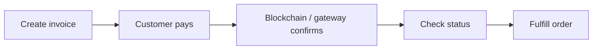

<Warning>
  This section is for **API-based stores**: stores you opened as an API Store in PapelShip to take payments from your own website, bot or app. If you run a regular PapelShip storefront (Digital Store), see the [Digital Store](/en/user-api/overview) tab instead.
</Warning>

The API Store lets any website or bot take payments through PapelShip. Pick the flow that fits your checkout.

<CardGroup cols={2}>
  <Card title="Hosted payment links" icon="link">
    PapelShip hosts the checkout. Your customer picks a method: credit card, Papara, bank transfer, or crypto.
  </Card>
  <Card title="Direct crypto invoices" icon="bitcoin-sign" href="/en/api-store/crypto-payments">
    You build the checkout. PapelShip gives you a unique deposit address, the exact crypto amount, and a QR code.
  </Card>
</CardGroup>

## Payment lifecycle



1. Create an invoice with [payment links](/en/quickstart) or a [crypto invoice](/en/api-store/crypto-payments).
2. The customer pays on the hosted checkout or to the deposit address.
3. Poll the [status endpoint](/en/api-store/crypto-payments#track-confirmations) until `is_paid` is `true`.
4. Fulfill the order. Issue [refunds](/en/api-store/overview#refunds) when needed.

## Supported currencies

Fiat amounts accept `USD`, `EUR`, `TRY`, and `GBP`. Crypto invoices support these coins:

| Coin | Symbol | Coin | Symbol |
| :--- | :--- | :--- | :--- |
| Bitcoin | `BTC` | Tether | `USDT` |
| Litecoin | `LTC` | USD Coin | `USDC` |
| Ethereum | `ETH` | Solana | `SOL` |
| Dogecoin | `DOGE` | BNB | `BNB` |
| Tron | `TRX` | | |

## Refunds

Refund a completed invoice fully, or partially with `amount_cents`:

```bash
curl -X POST https://app.papelship.com/api/api-store/v1/refunds \
  -H "Authorization: Bearer psa_your_api_key" \
  -H "Content-Type: application/json" \
  -d '{ "invoice_id": "aB9xK12Lp9012345678901234", "amount_cents": 1000, "reason": "Customer requested cancellation" }'
```
