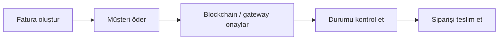

<Warning>
  Bu bölüm **API tabanlı mağazalar** içindir: PapelShip'te kendi web sitenizden, botunuzdan veya uygulamanızdan ödeme almak için API Store olarak açtığınız mağazalar. Normal bir PapelShip vitrin mağazası (Dijital Mağaza) işletiyorsanız [Dijital Mağaza](/tr/user-api/overview) sekmesine bakın.
</Warning>

API Store, herhangi bir web sitesinin veya botun PapelShip üzerinden ödeme almasını sağlar. Checkout'unuza uygun akışı seçin.

<CardGroup cols={2}>
  <Card title="Hosted ödeme linkleri" icon="link">
    Checkout'u PapelShip barındırır. Müşteriniz bir yöntem seçer: kredi kartı, Papara, havale veya kripto.
  </Card>
  <Card title="Doğrudan kripto faturaları" icon="bitcoin-sign" href="/tr/api-store/crypto-payments">
    Checkout'u siz tasarlarsınız. PapelShip size benzersiz bir deposit adresi, tam kripto tutarı ve QR kod verir.
  </Card>
</CardGroup>

## Ödeme yaşam döngüsü



1. [Ödeme linki](/tr/quickstart) veya [kripto faturası](/tr/api-store/crypto-payments) ile fatura oluşturun.
2. Müşteri hosted checkout'ta veya deposit adresine ödeme yapar.
3. `is_paid` değeri `true` olana kadar [durum endpoint'ini](/tr/api-store/crypto-payments) sorgulayın.
4. Siparişi teslim edin. Gerekirse [iade](/tr/api-store/overview#iadeler) yapın.

## Desteklenen para birimleri

Fiat tutarlar `USD`, `EUR`, `TRY` ve `GBP` kabul eder. Kripto faturaları şu coinleri destekler:

| Coin | Sembol | Coin | Sembol |
| :--- | :--- | :--- | :--- |
| Bitcoin | `BTC` | Tether | `USDT` |
| Litecoin | `LTC` | USD Coin | `USDC` |
| Ethereum | `ETH` | Solana | `SOL` |
| Dogecoin | `DOGE` | BNB | `BNB` |
| Tron | `TRX` | | |

## İadeler

Tamamlanmış bir faturayı tamamen veya `amount_cents` ile kısmen iade edin:

```bash
curl -X POST https://app.papelship.com/api/api-store/v1/refunds \
  -H "Authorization: Bearer psa_your_api_key" \
  -H "Content-Type: application/json" \
  -d '{ "invoice_id": "aB9xK12Lp9012345678901234", "amount_cents": 1000, "reason": "Müşteri iptal talep etti" }'
```
